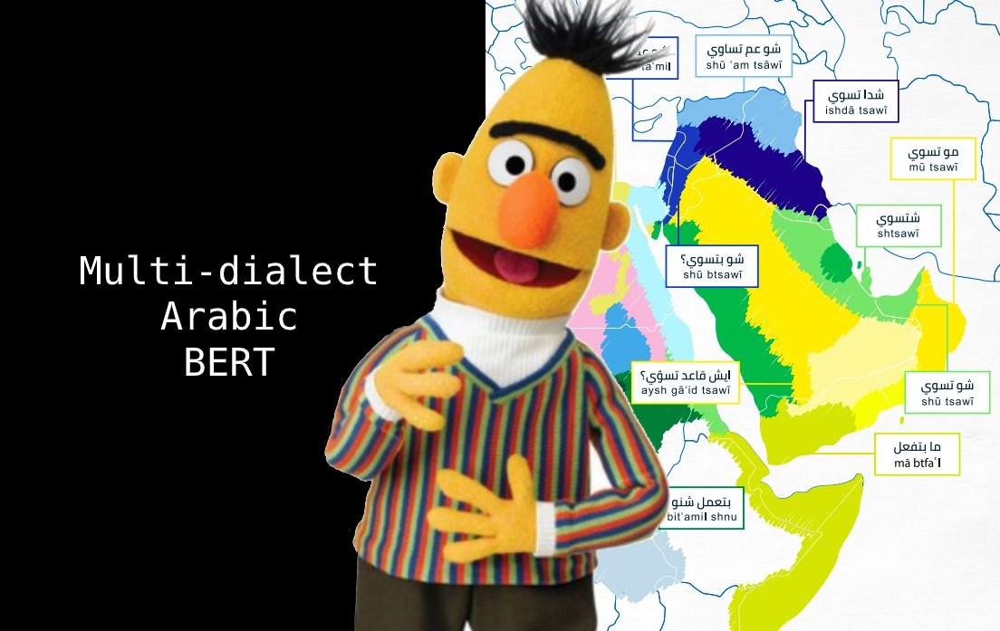

# Multi-dialect-Arabic-BERT
This is a repository of Multi-dialect Arabic BERT model.

<p align="center">
    <br>
    
    <br>
<p>


### About our Multi-dialect-Arabic-BERT model
Instead of training the Multi-dialect Arabic BERT model from scratch, we initialized the weights of the model using [Arabic-BERT](https://github.com/alisafaya/Arabic-BERT) and trained it on 10M arabic tweets from the unlabled data of [The Nuanced Arabic Dialect Identification (NADI) shared task](https://sites.google.com/view/nadi-shared-task).

### To cite this work
We haven't published any paper on this work. Please cite this repository:
```
@inproceedings{talafha2019mawdoo3,
  title={Mawdoo3 AI at MADAR Shared Task: Arabic Tweet Dialect Identification},
  author={Talafha, Bashar and Farhan, Wael and Altakrouri, Ahmed and Al-Natsheh, Hussein},
  booktitle={Proceedings of the Fourth Arabic Natural Language Processing Workshop},
  pages={239--243},
  year={2019}
}

```
We will update the BibTeX once the paper published.
### Usage
The model weights can be loaded using `transformers` library by HuggingFace.

```python
from transformers import AutoTokenizer, AutoModel

tokenizer = AutoTokenizer.from_pretrained("bashar-talafha/multi-dialect-bert-base-arabic")
model = AutoModel.from_pretrained("bashar-talafha/multi-dialect-bert-base-arabic")
```

Example using `pipeline`:

```python
from transformers import pipeline

fill_mask = pipeline(
    "fill-mask",
    model="bashar-talafha/multi-dialect-bert-base-arabic ",
    tokenizer="bashar-talafha/multi-dialect-bert-base-arabic "
)

fill_mask(" سافر الرحالة من مطار [MASK] ")
```
```
[{'sequence': '[CLS] سافر الرحالة من مطار الكويت [SEP]', 'score': 0.08296813815832138, 'token': 3226},
 {'sequence': '[CLS] سافر الرحالة من مطار دبي [SEP]', 'score': 0.05123933032155037, 'token': 4747},
 {'sequence': '[CLS] سافر الرحالة من مطار مسقط [SEP]', 'score': 0.046838656067848206, 'token': 13205},
 {'sequence': '[CLS] سافر الرحالة من مطار القاهرة [SEP]', 'score': 0.03234650194644928, 'token': 4003},
 {'sequence': '[CLS] سافر الرحالة من مطار الرياض [SEP]', 'score': 0.02606341242790222, 'token': 2200}]
```

### Model Parameters

| Parameter | Value |
| ------------- | ------------- |
| architecture  | BertForMaskedLM  |
| hidden_size  | 768  |
| max_position_embeddings  | 512  |
| num_attention_heads  | 12  |
| num_hidden_layers  | 12  |
| vocab_size  | 32000  |
| hidden_size  | 768  |
<strong> Total number of parameters </strong> | <strong> 110M</strong>

